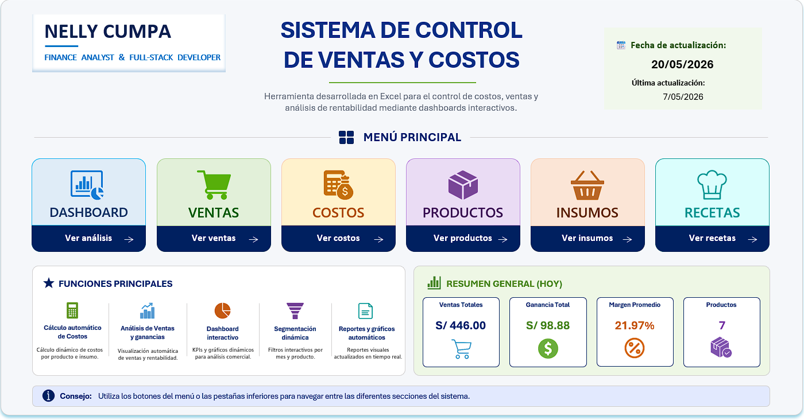
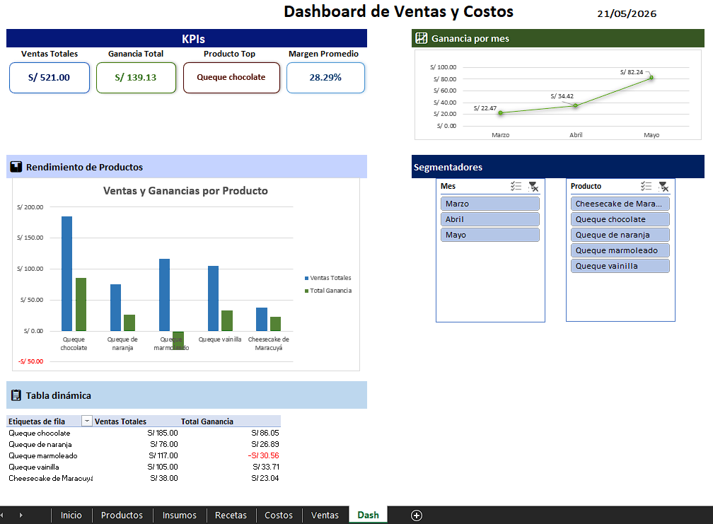
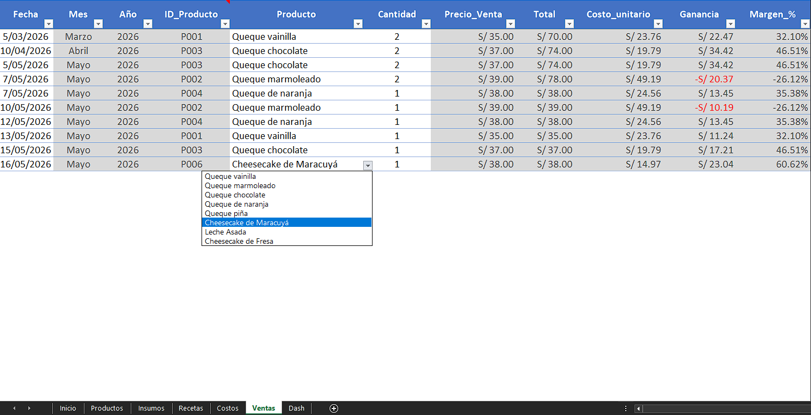
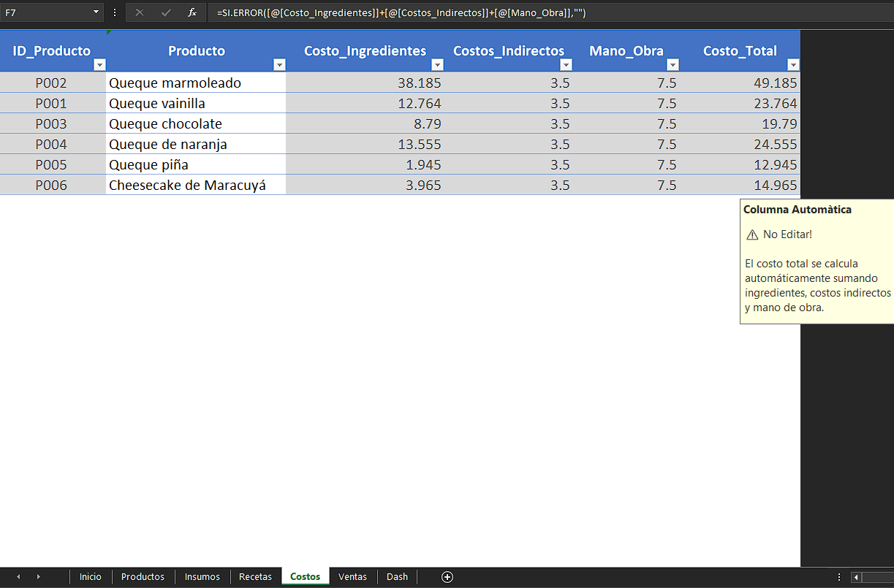
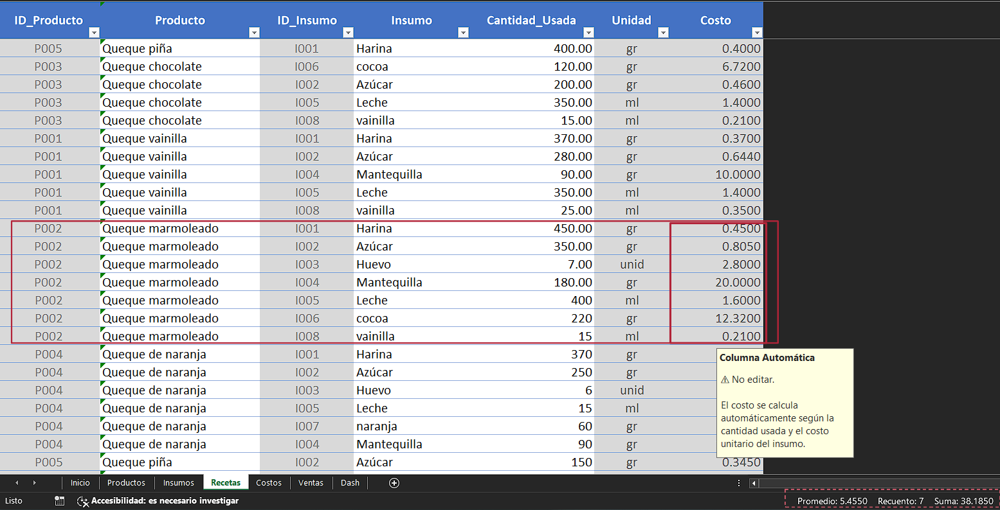
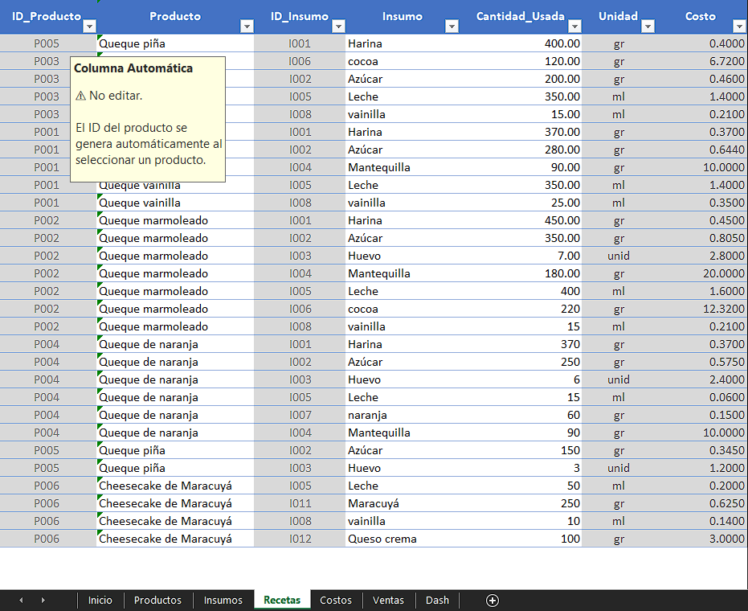
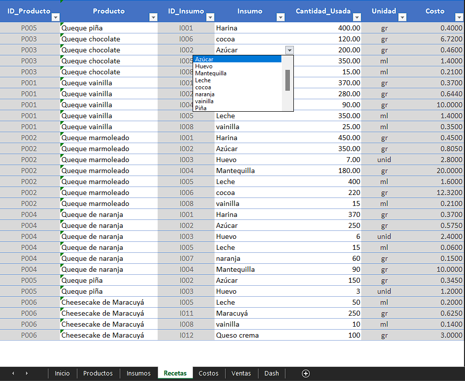

# 🎂 Sistema Automatizado de Gestión Comercial y Costos para Pastelería

Este proyecto consiste en un sistema automatizado desarrollado en Excel para la gestión integral de ventas, costos y rentabilidad en un negocio de pastelería.

La solución permite controlar recetas, calcular costos reales de producción, analizar márgenes de ganancia y visualizar indicadores clave mediante dashboards interactivos, optimizando la toma de decisiones comerciales.

## 🚀 Funcionalidades Principales
* Automatización de Costos de Producción
Cálculo automático de costos por receta considerando ingredientes, mano de obra y costos indirectos.
* Conversión Inteligente de Unidades
Transformación automática de unidades de compra (Kg/Litros) a unidades base (gramos/mililitros) mediante fórmulas dinámicas.
* Gestión Relacional de Productos e Insumos
Relación automatizada entre productos, recetas e insumos para evitar duplicidad de información y facilitar actualizaciones de precios.
* Dashboards Interactivos
Visualización dinámica de ventas, ganancias y márgenes mediante gráficos y segmentadores.
* Validación y Protección de Datos
Uso de listas dinámicas, validaciones automatizadas y protección parcial de columnas para reducir errores de ingreso.

## 🛠 Herramientas Utilizadas
* Microsoft Excel
* Fórmulas avanzadas
* Tablas dinámicas
* Segmentadores de datos
* Validación dinámica de datos
* Formato condicional
* Dashboards interactivos

## 📈 Objetivo del Proyecto

Desarrollar una herramienta práctica y visual que permita a pequeños negocios controlar costos de producción, analizar rentabilidad y automatizar procesos administrativos sin necesidad de software especializado.

## 📸 Capturas de Pantalla
### 🏠 Inicio del Sistema
Vista principal del sistema con acceso a los módulos operativos y resumen general de indicadores comerciales.

### 📊 Dashboard Ejecutivo
Panel interactivo para el análisis de ventas, ganancias y rentabilidad mediante KPIs, gráficos y segmentadores dinámicos.

### 💰 Registro Automatizado de Ventas
Sistema de registro comercial con cálculos automáticos de costos, ganancias y márgenes de rentabilidad.

### 🧾 Gestión de Costos de Producción
Cálculo automático de costos totales considerando ingredientes, mano de obra y costos indirectos.

### 🍰 Automatización de Recetas e Insumos
Relación automatizada entre productos, ingredientes y costos mediante validaciones dinámicas y fórmulas inteligentes.

### 📋 Validación Dinámica de Ingredientes
Listas desplegables inteligentes vinculadas a tablas oficiales para evitar errores y facilitar el registro de recetas.

## 🎥 Video Demostrativo
